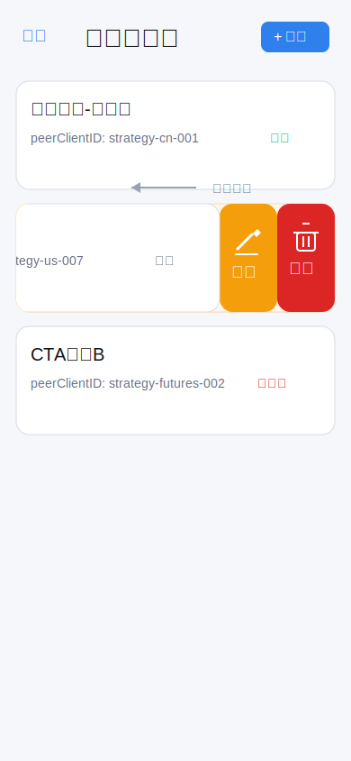
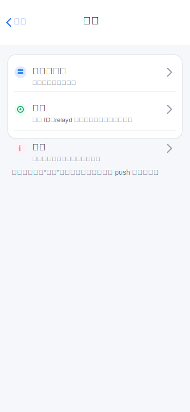
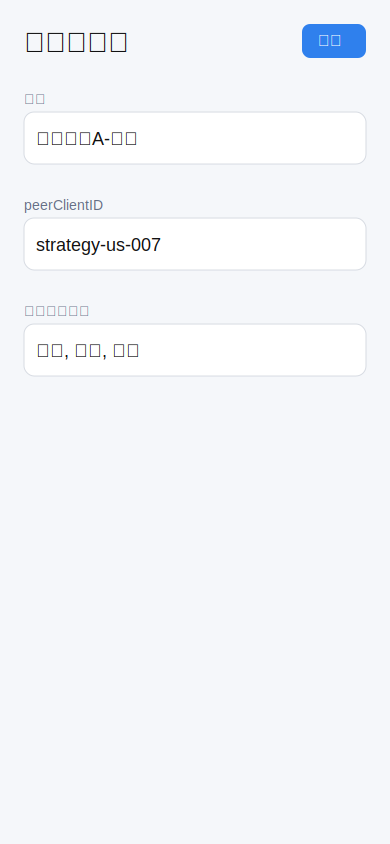

# iOS 量化指令聊天 App 设计文档（Swift + SwiftUI，V4）

> 目标：重写为“**首页可添加量化服务端**，**点击任一服务端进入会话发送指令**”的实现方案，并使用图片原型表达关键界面。

## 1. 需求重述（本版）

- iOS App 使用 **Swift + SwiftUI** 开发。
- 首页展示多个量化服务端（每个服务端对应一个 `peerClientID`）。
- 首页可直接“添加服务端”。
- 点击服务端进入独立会话窗口，发送策略指令并接收结果。
- 保留设置页：可复制自己的 ID，并配置 relayd 通信参数。
- 服务端和协议基础：
  - 量化后端：<https://github.com/hangchow/backtest>
  - 中继与协议：<https://github.com/hangchow/relayd>

---

## 2. 产品结构

### 2.1 页面结构（简化）

```text
首页（服务端列表）
  ├── 左上角功能入口（全屏功能页）
  │   ├── 所有服务端
  │   ├── 设置
  │   └── 关于
  ├── 新增/编辑服务端（sheet）
  ├── 服务端卡片（点击进入）
  └── 右上角添加

会话页（按服务端）
  ├── 消息流（指令/结果/系统消息）
  ├── 指令输入框 + 发送
  └── 失败重试/超时提示

设置页
  ├── 我的 clientID（复制）
  ├── relay host/port
  ├── 自动重连
  ├── 响应超时
  └── 连接测试
```

### 2.2 核心用户流程

1. 首次打开 App，在首页点击“添加”。
2. 输入服务端名称 + `peerClientID`，保存后出现在首页列表。
3. 点击某个服务端卡片进入会话。
4. 输入指令（如 `pool.add AAPL`）并发送。
5. 收到返回并展示在消息流中。

---

## 3. 原型图（图片版）

## 3.1 首页：服务端列表 + 添加入口 + 全屏功能页入口





设计要点：
- 首页聚焦“服务端卡片列表”，不额外引入联系人层级。
- 每张卡片显示：名称、`peerClientID`、连接状态。
- 首页左上角提供“功能”入口，参考 iOS Messages 的文本按钮样式。
- 点击“功能”后，全屏进入功能页（导航 push 动效），包含“所有服务端”“设置”“关于”。
- 设置入口从首页右上角迁移到功能页内，统一收口导航。
- 服务端卡片支持左滑露出“编辑”“删除”操作，便于快速维护节点。
- 顶部“+ 添加”入口固定在首页右上角。

## 3.2 新增/编辑服务端（Sheet）




设计要点：
- 字段最少化：`name`、`peerClientID`、`tags(可选)`。
- 新增与编辑复用同一套 Sheet 表单，降低交互复杂度。
- 编辑态默认回填已有服务端信息，保存后返回首页列表。

## 3.3 会话页：发送指令与响应


设计要点：
- 左上角提供返回按钮，可返回首页的服务端列表。
- 气泡区分发送与接收。
- 输入框建议内置指令占位提示（示例命令）。
- 发送失败在消息尾部标记并支持重试。

## 3.4 设置页：我的ID与连接参数


设计要点：
- 一键复制我的 ID（用于配置到量化服务端）。
- 从首页左上角“功能”页进入设置页，左上角可返回功能页。
- relay host/port、自动重连、响应超时等全局连接策略统一在此配置。
- relay host/port 可快速调整并测试连接。

---

## 4. 技术设计（Swift + SwiftUI）

## 4.1 推荐工程结构

```text
App/
  QuantChatApp.swift              // App 入口，挂载根导航与全局依赖
  AppSessionStore.swift          // 全局会话与连接状态，协调导航和 relay 连接生命周期

Features/
  Servers/
    ServerListView.swift          // 首页服务端列表页，展示节点并处理进入会话
    AddServerSheet.swift          // 新增/编辑服务端的弹窗表单
    ServerListViewModel.swift     // 服务端列表的数据加载、增删改查与状态聚合
    FunctionHubView.swift         // 全屏功能页，提供所有服务端、设置、关于入口
  Chat/
    ChatView.swift                // 单个服务端的会话页
    ChatViewModel.swift           // 指令发送、消息流更新、重试与超时处理
    MessageRow.swift              // 单条消息气泡与状态展示
  Settings/
    SettingsView.swift            // 设置页，展示我的 clientID 与 relay 参数和全局连接策略
    SettingsViewModel.swift       // 设置读取、保存、自动重连与连接测试逻辑
  About/
    AboutView.swift               // 关于页，展示版本信息、项目链接、说明文档

Domain/
  Models/
    ServerEndpoint.swift          // 服务端节点模型
    ChatMessage.swift             // 会话消息模型
    AppSettings.swift             // 应用级配置模型
  UseCases/
    SendCommandUseCase.swift      // 将指令封装后发送到指定服务端
    RouteInboundMessageUseCase.swift // 将收到的消息路由到正确会话

Data/
  Relay/
    RelaydClient.swift            // 与 relayd 建立连接、收发消息
    RelaydFrameCodec.swift        // relayd 协议帧编码与解码
  Repositories/
    ServerRepository.swift        // 服务端节点的持久化读写
    MessageRepository.swift       // 聊天记录的持久化读写
    SettingsRepository.swift      // 设置项的持久化读写
```

模块职责说明：
- `App`：应用启动层，负责组装根视图、导航容器和全局状态对象。
- `Features/Servers`：首页服务端列表模块，负责展示节点、新增/编辑/删除节点，以及进入会话页。
- `Features/Chat`：会话交互模块，负责消息展示、指令发送、失败重试和超时反馈。
- `Features/Settings`：设置模块，负责展示我的 `clientID`、维护 relay 参数、自动重连和连接测试。
- `Features/About`：关于模块，负责展示版本信息、项目链接和说明文档入口。
- `Domain/Models`：核心业务模型定义，保持与 UI 和存储实现解耦。
- `Domain/UseCases`：业务用例层，封装“发送指令”“路由入站消息”等核心动作。
- `Data/Relay`：协议通信层，负责 relayd 的连接管理和报文编解码。
- `Data/Repositories`：数据持久化层，负责服务端、消息、设置的本地存取。

## 4.2 核心数据模型

```swift
struct ServerEndpoint: Identifiable, Codable, Hashable {
    let id: UUID                 // 服务端记录唯一标识，用于列表与会话绑定
    var name: String             // 首页展示名称，例如“招商证券-主账户”
    var peerClientID: String     // 目标服务端在 relayd 中的 clientID
    var tags: [String]           // 可选标签，用于分类或补充说明
    var isEnabled: Bool          // 是否启用该服务端节点
    var createdAt: Date          // 创建时间，用于排序或审计
    var updatedAt: Date          // 最近修改时间，用于展示或同步
}

enum MessageDirection: String, Codable {
    case outgoing  // 我方发出的指令消息
    case incoming  // 服务端返回的结果消息
    case system    // 系统提示，如超时、重连、错误说明
}

enum MessageState: String, Codable {
    case sending   // 已入本地消息流，等待底层 relay 发送完成
    case sent      // 已成功写入 relay 连接，不代表已收到业务结果
    case failed    // 发送失败，可提示用户重试
    case timeout   // 在超时时间内未收到匹配 reply_to 的结果
}

struct ChatMessage: Identifiable, Codable, Hashable {
    let id: UUID                         // 本地消息记录唯一标识
    let serverID: UUID                   // 所属服务端，用于归档到正确会话
    let messageID: String                // 应用层消息 ID，用于请求/响应配对
    var replyToMessageID: String?        // 若为响应消息，指向对应请求的 messageID
    let direction: MessageDirection      // 消息方向：发送、接收或系统
    var text: String                     // 消息正文，可能是指令、结果或提示文本
    let createdAt: Date                  // 消息创建时间，用于会话排序展示
    var state: MessageState              // 当前发送状态或响应状态
}

struct AppSettings: Codable {
    var myClientID: String              // 当前 iOS 端自己的 clientID
    var relayHost: String               // relayd 服务地址
    var relayPort: Int                  // relayd 服务端口
    var isAutoReconnectEnabled: Bool    // 是否开启全局自动重连策略
    var responseTimeoutSec: Int         // 指令发送后等待响应的超时时间
}
```

## 4.3 导航与状态管理

- 首页使用 `NavigationStack`。
- 首页左上角“功能”通过 `NavigationLink` 进入全屏 `FunctionHubView`。
- 新增/编辑服务端使用 `.sheet`。
- 点击服务端通过 `NavigationLink(value:)` 进入 `ChatView(server:)`。
- 功能页中的“设置”进入 `SettingsView`，“关于”进入 `AboutView`，“所有服务端”返回首页根列表。
- 全局连接状态通过 `@EnvironmentObject AppSessionStore` 下发，并根据 `AppSettings.isAutoReconnectEnabled` 协调重连策略。

---

## 5. 与 relayd/backtest 的交互约定

## 5.1 路由规则

- 发送：`ToClientID = server.peerClientID`
- 接收：按 `FromClientID` 反查 `ServerEndpoint`，再归档到对应会话。

## 5.2 应用层消息建议格式

- 所有应用层消息都应携带唯一 `message_id` 与发送时间 `ts`，便于持久化、去重和调试。
- 响应消息使用 `reply_to` 关联对应请求；若一条请求产生多条响应，每条响应仍使用自己的 `message_id`。

发送命令：

```json
{
  "type": "command",
  "message_id": "ios-1742890001-001",
  "ts": 1742890001,
  "body": "pool.add AAPL"
}
```

返回结果：

```json
{
  "type": "result",
  "message_id": "server-1742890002-001",
  "reply_to": "ios-1742890001-001",
  "ts": 1742890002,
  "ok": true,
  "output": "pool_size=12"
}
```

---

## 6. 关键实现细节

### 6.1 首页服务端维护能力

- 首页空状态直接给出“添加服务端”按钮。
- `peerClientID` 校验：非空、去首尾空格、禁止重复。
- 保存成功后自动滚动到新卡片并可点击进入会话。
- 服务端卡片左滑可直接触发“编辑”“删除”操作。

### 6.2 会话发送体验

- 发送时先本地插入 `sending` 消息（乐观更新）。
- `RelaydClient` 成功写入连接后将消息状态改为 `sent`，该状态仅表示消息已发出。
- 收到匹配 `reply_to` 的结果后，追加一条 `incoming` 消息到当前会话。
- 超时后将原始指令消息置为 `timeout` 并展示“重发”。

### 6.3 连接可靠性

- App 前台维持 `NWConnection`。
- 是否自动重连由 `AppSettings.isAutoReconnectEnabled` 控制。
- 开启自动重连后按指数退避重连（1s/2s/4s...上限 30s）。
- 首页卡片展示每个服务端最近通信状态（在线/空闲/重连中）。

---

## 7. V1 验收标准

- 可在首页新增、编辑、删除多个服务端。
- 可从首页左上角进入全屏功能页，并进入设置页和关于页。
- 点击任一服务端可进入会话并正常发送命令。
- 可收到并展示来自对应服务端的响应。
- 设置页可复制我的 ID，支持配置 host/port、自动重连、响应超时，并可连接测试。
- 重启后服务端列表和聊天记录可恢复。

---

## 8. 迭代建议（V1→V2）

- 指令模板（常用命令快捷发送）。
- 会话内按 `message_id` 折叠请求/响应对。
- 多账号身份切换（多 `myClientID`）。
- 针对 backtest 响应增加结构化渲染（表格/标签）。
