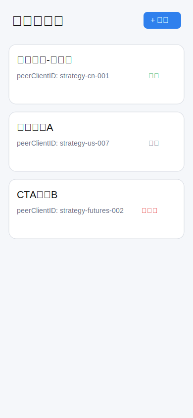
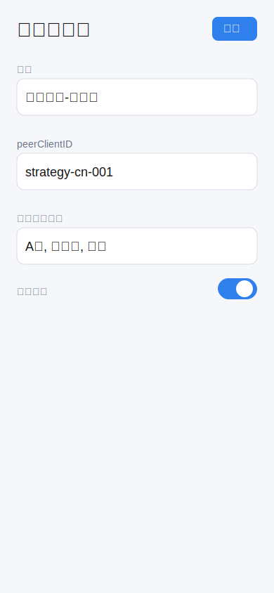
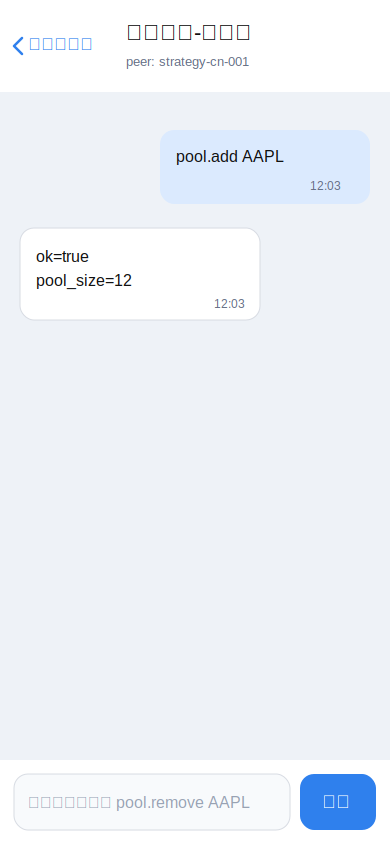
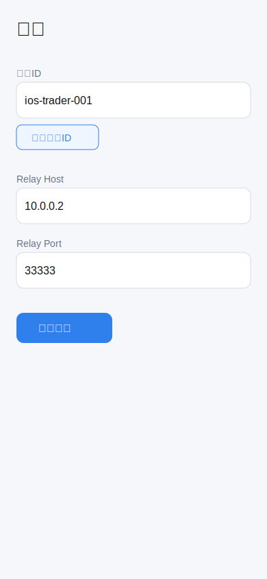

# iOS 量化指令聊天 App 设计文档（Swift + SwiftUI，V4）

> 目标：重写为“**首页可添加量化服务端**，**点击任一服务端进入会话发送指令**”的实现方案，并使用图片原型表达关键界面。

## 1. 需求重述（本版）

- iOS App 使用 **Swift + SwiftUI** 开发。
- 首页展示多个量化服务端（每个服务端对应一个 `peerClientID`）。
- 首页可直接“添加服务端”。
- 点击服务端进入独立会话窗口，发送策略指令并接收结果。
- 保留设置页：可复制自己的 ID，并配置 relayd 通信参数。
- 服务端和协议基础：
  - 量化后端：<https://github.com/hangchow/backtest>
  - 中继与协议：<https://github.com/hangchow/relayd>

---

## 2. 产品结构

### 2.1 页面结构（简化）

```text
首页（服务端列表）
  ├── 新增服务端（sheet）
  ├── 服务端卡片（点击进入）
  └── 右上角设置

会话页（按服务端）
  ├── 消息流（指令/结果/系统消息）
  ├── 指令输入框 + 发送
  └── 失败重试/超时提示

设置页
  ├── 我的 clientID（复制）
  ├── relay host/port
  └── 连接测试
```

### 2.2 核心用户流程

1. 首次打开 App，在首页点击“添加”。
2. 输入服务端名称 + `peerClientID`，保存后出现在首页列表。
3. 点击某个服务端卡片进入会话。
4. 输入指令（如 `pool.add AAPL`）并发送。
5. 收到返回并展示在消息流中。

---

## 3. 原型图（图片版）

## 3.1 首页：服务端列表 + 添加入口



设计要点：
- 首页聚焦“服务端卡片列表”，不额外引入联系人层级。
- 每张卡片显示：名称、`peerClientID`、连接状态。
- 顶部“+ 添加”入口固定在首页。

## 3.2 新增服务端（Sheet）



设计要点：
- 字段最少化：`name`、`peerClientID`、`tags(可选)`。
- 保存后立即回到首页并可直接进入会话。

## 3.3 会话页：发送指令与响应



设计要点：
- 气泡区分发送与接收。
- 输入框建议内置指令占位提示（示例命令）。
- 发送失败在消息尾部标记并支持重试。

## 3.4 设置页：我的ID与 relayd 参数



设计要点：
- 一键复制我的 ID（用于配置到量化服务端）。
- relay host/port 可快速调整并测试连接。

---

## 4. 技术设计（Swift + SwiftUI）

## 4.1 推荐工程结构

```text
App/
  QuantChatApp.swift

Features/
  Servers/
    ServerListView.swift
    AddServerSheet.swift
    ServerListViewModel.swift
  Chat/
    ChatView.swift
    ChatViewModel.swift
    MessageRow.swift
  Settings/
    SettingsView.swift
    SettingsViewModel.swift

Domain/
  Models/
    ServerEndpoint.swift
    ChatMessage.swift
    AppSettings.swift
  UseCases/
    SendCommandUseCase.swift
    RouteInboundMessageUseCase.swift

Data/
  Relay/
    RelaydClient.swift
    RelaydFrameCodec.swift
  Repositories/
    ServerRepository.swift
    MessageRepository.swift
    SettingsRepository.swift
```

## 4.2 核心数据模型

```swift
struct ServerEndpoint: Identifiable, Codable, Hashable {
    let id: UUID
    var name: String
    var peerClientID: String
    var tags: [String]
    var isEnabled: Bool
    var createdAt: Date
    var updatedAt: Date
}

enum MessageDirection: String, Codable {
    case outgoing, incoming, system
}

enum MessageState: String, Codable {
    case sending, sent, failed, timeout
}

struct ChatMessage: Identifiable, Codable, Hashable {
    let id: UUID
    let serverID: UUID
    let messageID: String
    var replyToMessageID: String?
    let direction: MessageDirection
    var text: String
    let createdAt: Date
    var state: MessageState
}

struct AppSettings: Codable {
    var myClientID: String
    var relayHost: String
    var relayPort: Int
    var responseTimeoutSec: Int
}
```

## 4.3 导航与状态管理

- 首页使用 `NavigationStack`。
- 新增服务端使用 `.sheet`。
- 点击服务端通过 `NavigationLink(value:)` 进入 `ChatView(server:)`。
- 全局连接状态通过 `@EnvironmentObject AppSessionStore` 下发。

---

## 5. 与 relayd/backtest 的交互约定

## 5.1 路由规则

- 发送：`ToClientID = server.peerClientID`
- 接收：按 `FromClientID` 反查 `ServerEndpoint`，再归档到对应会话。

## 5.2 应用层消息建议格式

发送命令：

```json
{
  "type": "command",
  "message_id": "ios-1742890001-001",
  "ts": 1742890001,
  "body": "pool.add AAPL"
}
```

返回结果：

```json
{
  "type": "result",
  "reply_to": "ios-1742890001-001",
  "ok": true,
  "output": "pool_size=12"
}
```

---

## 6. 关键实现细节

### 6.1 首页添加服务端能力

- 首页空状态直接给出“添加服务端”按钮。
- `peerClientID` 校验：非空、去首尾空格、禁止重复。
- 保存成功后自动滚动到新卡片并可点击进入会话。

### 6.2 会话发送体验

- 发送时先本地插入 `sending` 消息（乐观更新）。
- 收到回执后将状态改为 `sent`。
- 超时后置为 `timeout` 并展示“重发”。

### 6.3 连接可靠性

- App 前台维持 `NWConnection`。
- 断线后指数退避重连（1s/2s/4s...上限 30s）。
- 首页卡片展示每个服务端最近通信状态（在线/空闲/重连中）。

---

## 7. V1 验收标准

- 可在首页新增、编辑、删除多个服务端。
- 点击任一服务端可进入会话并正常发送命令。
- 可收到并展示来自对应服务端的响应。
- 设置页可复制我的 ID，且 host/port 修改后可连接测试。
- 重启后服务端列表和聊天记录可恢复。

---

## 8. 迭代建议（V1→V2）

- 指令模板（常用命令快捷发送）。
- 会话内按 `message_id` 折叠请求/响应对。
- 多账号身份切换（多 `myClientID`）。
- 针对 backtest 响应增加结构化渲染（表格/标签）。
